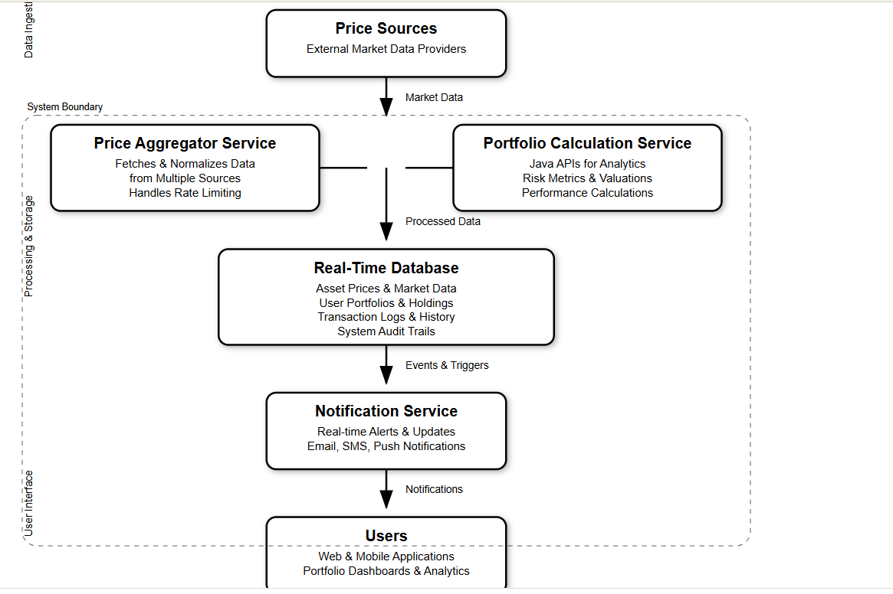

# 📊 Real-Time Portfolio Management System Design

---

## 📌 System Architecture Description

A real-time portfolio management platform designed to handle asset price updates from multiple sources, calculate user portfolio values, and deliver real-time notifications — built using scalable microservices.

---

## 📈 Data Flow

**Price Sources → Processing Layer → Storage → Notification → Users**

---

## 🛠️ Components

### 📡 Price Sources  
External market data providers supplying real-time financial information.

### 🔄 Price Aggregator Service  
Fetches and normalizes data from multiple sources, handling rate limiting and data discrepancies.

### 🧮 Portfolio Calculation Service  
Java-based APIs that compute analytics, risk metrics, valuations, and performance calculations for user portfolios.

### 🗄️ Real-Time Database  
Centralized storage system for:
- Asset prices
- User portfolios  
- Transaction logs  
- Audit trails  

Supports both relational and NoSQL storage solutions.

### 📢 Notification Service  
Delivers real-time alerts to users via:
- Email  
- SMS  
- Push notifications  

Ensures timely updates on portfolio changes or significant market events.

### 👨‍💻 Users  
Accessible through web and mobile applications providing:
- Portfolio dashboards  
- Real-time analytics  
- Transaction history  

---

## 🌟 Key Features

- **Microservices Architecture** for horizontal scalability and isolated service management.
- **Real-Time Data Processing and Updates** ensuring users receive the latest portfolio values instantly.
- **Comprehensive Data Storage and Logging** for auditing, debugging, and compliance.
- **Multi-Channel Notification System** for timely alerts and portfolio insights.
- **Responsive User Interfaces** across web and mobile platforms for a seamless user experience.

---
